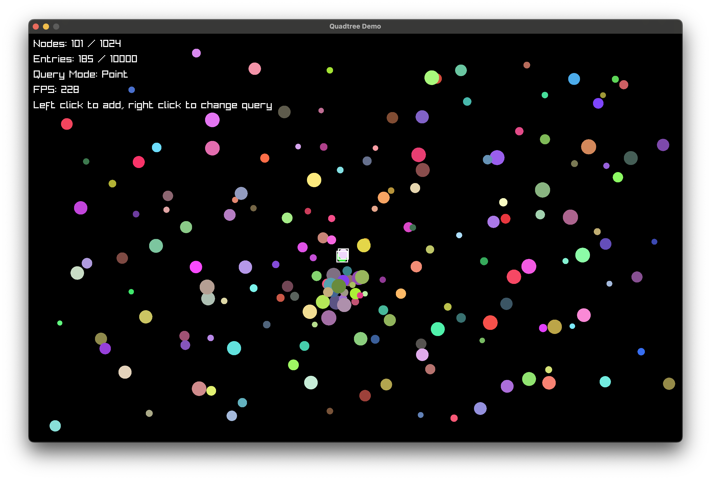
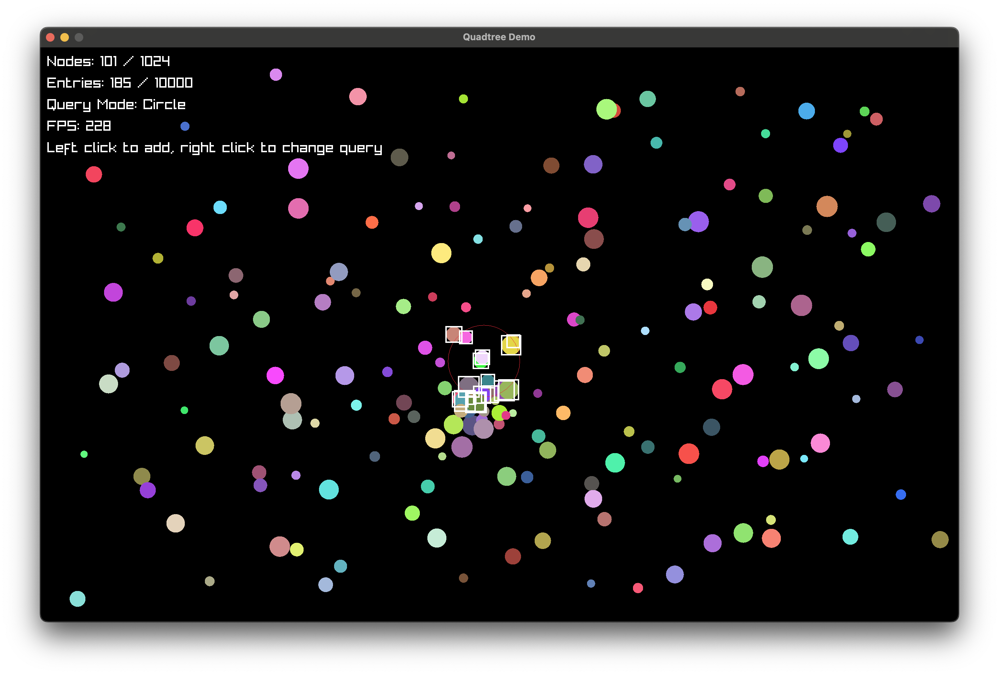

# Quadtree for Odin

This is an implementation of quadtrees for Odin, with fixed-size data structure.

The entire source is in `src/quadtree.odin`.

## Usage

```odin
tree: qt.Quadtree(maxNodes, maxEntries, entriesPerNode, maxResults, YourDataType)
bounds := qt.Rectangle{x, y, width, height}
qt.init(&tree, bounds)

qt.insert(&tree, qt.Rectangle{150, 200, 10, 10}, data)

results := qt.query_point(&tree, x, y)
for result in results {
  // do something with result.data
}

results = qt.query_rectangle(&tree, qt.Rectangle{})
results = qt.query_circle(&tree, radius)
```

The Quadtree struct requires some parameters:

- MaxNodes - You can calculate how many you need with `1 + 4^subdivisions` depending on how many times you want to subdivide the whole area. For example, dividing the screen into 16ths requires 4 subdivisions, which requires 1+4^4 = 257 nodes.
- MaxEntries - The max number of entries you will add to the tree.
- EntriesPerNode - The max number of entries that sit on a boundary line and cannot be moved into a subdivision.
- MaxResults - The max number of results you want to fetch from queries.
- T - this is the type of data you want to store with each entry.

## Demo

See `demo/demo.odin` for a working example.

```
odin run demo
```

Point query:


Rectangle query:


Circle query:

