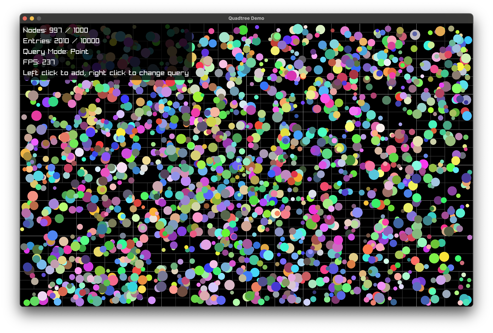
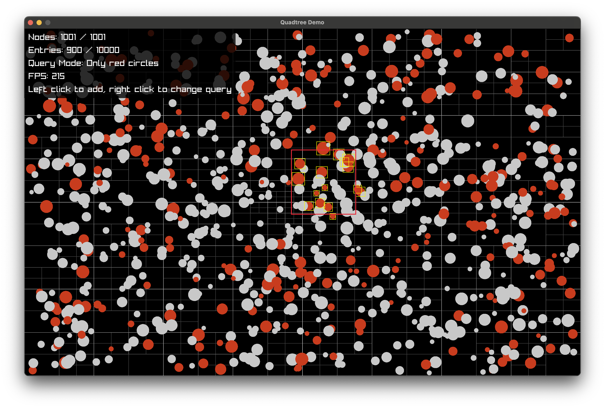
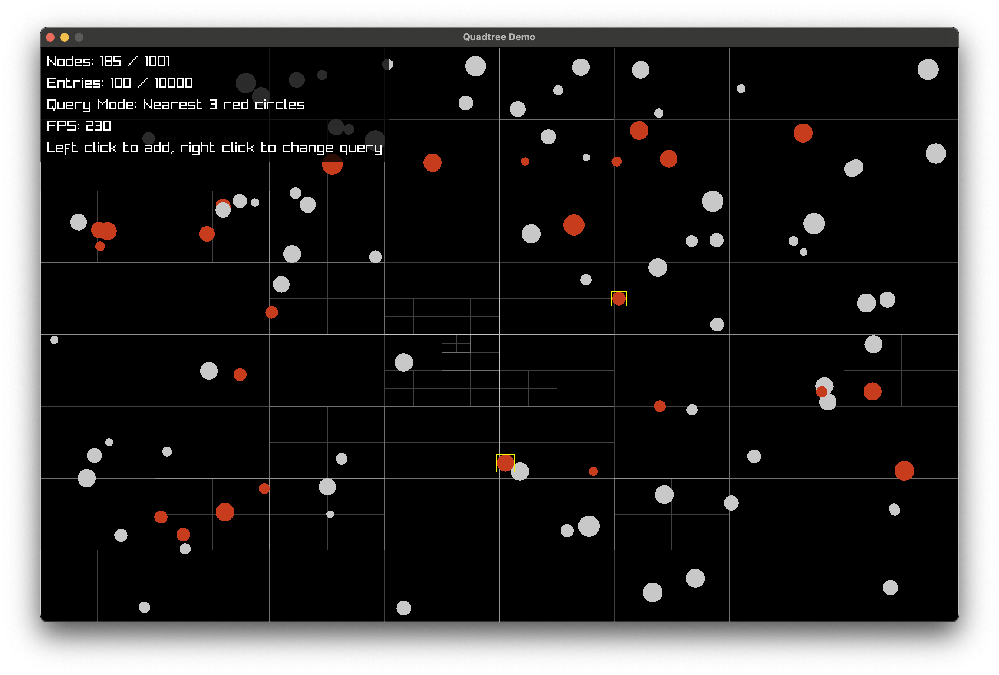

# Quadtree for Odin

This is an implementation of quadtrees for Odin, with fixed-size data structure - no dynamic allocations.

The entire source is in `src/quadtree.odin`.



## Usage

```odin
tree: qt.Quadtree(maxNodes, maxEntries, maxResults, YourDataType)
qt.init(&tree, {x, y, width, height})

// Insert
index, ok := qt.insert(&tree, {150, 200, 10, 10}, data)

// Update
index2, ok2 := qt.update(&tree, index, {160, 180, 10, 10}, data)
assert(index == index2, "Index does not change between updates")

// Remove
ok := qt.remove(&tree, index)

// Search
results := qt.query_point(&tree, x, y)
results = qt.query_rectangle(&tree, {x, y, width, height})
results = qt.query_circle(&tree, x, y, radius)
results = qt.query_nearest(&tree, x, y, k)

// Search with predicate
results = qt.query_rectangle(&tree, rect, proc(entry: qt.Entry(int)) -> bool {
  return entry.data % 2 == 0
})
results = qt.query_circle(&tree, x, y, radius, proc(entry: qt.Entry(int)) -> bool {
  return entry.data % 2 == 0
})
results = qt.query_point(&tree, x, y, proc(entry: qt.Entry(int)) -> bool {
  return entry.data % 2 == 0
})
results = qt.query_point(&tree, x, y, k, proc(entry: qt.Entry(int)) -> bool {
  return entry.data % 2 == 0
})

for entry in results {
  // entry.data is the same data that was inserted/updated
}

```

The Quadtree struct requires some parameters:

- **MaxNodes** - Each time an area is subdivided, 4 nodes are added. `(MaxNodes - 1)` should be a multiple of 4 (4 for each subdivision + 1 root node).
- **MaxEntries** - The max number of entries you will add to the tree.
- **MaxResults** - The max number of results you want to fetch from queries.
- **T** - this is the type of data you want to store with each entry.

## Search with predicates

You can pass a predicate to query functions to filter out entries while searching. This is especially useful when combined with nearest search.

Use the context pointer to pass extra data into the predicate function:

```odin
context.user_ptr = your_data
results = qt.query_rectangle(&tree, qt.Rectangle{}, proc(entry: qt.Entry(int)) -> bool {
  your_data := cast(^[]YourData)context.user_ptr
  return your_data[entry.data].field < 10
})
```

## Demo

See `demo/demo.odin` for a working example.

```
odin run demo
```

Point query:


Rectangle query:


Circle query:


Predicate query:


Nearest query:
