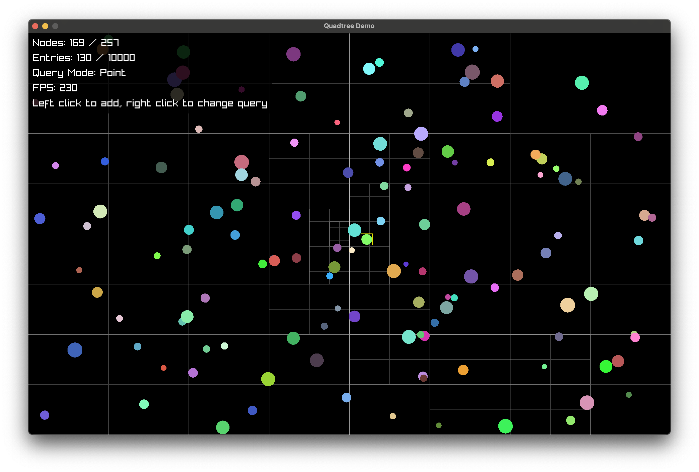
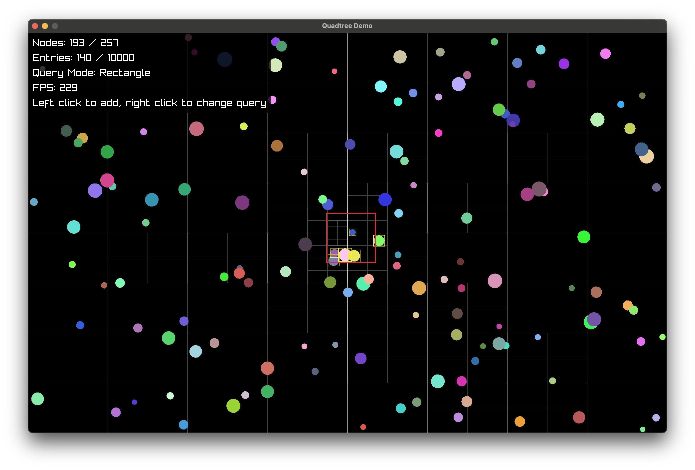
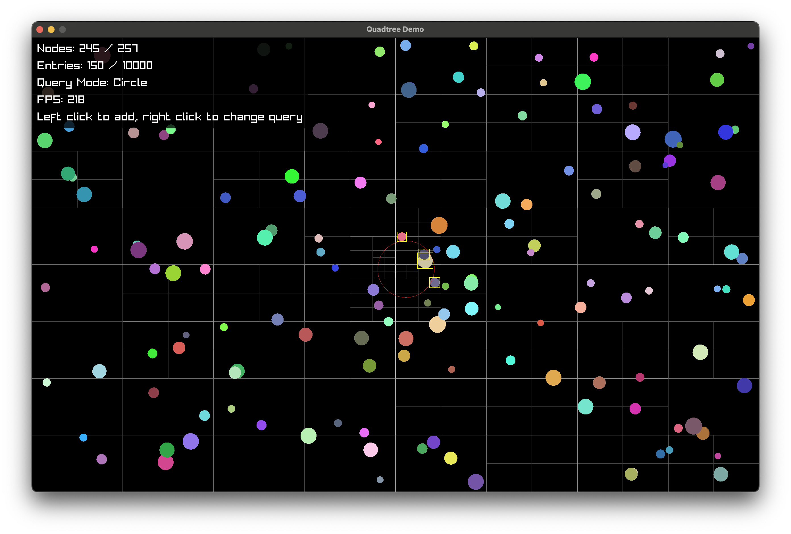

# Quadtree for Odin

This is an implementation of quadtrees for Odin, with fixed-size data structure - no dynamic allocations.

The entire source is in `src/quadtree.odin`.


## Usage

```odin
tree: qt.Quadtree(maxNodes, maxEntries, maxResults, YourDataType)
bounds := qt.Rectangle{x, y, width, height}
qt.init(&tree, bounds)

index, ok := qt.insert(&tree, qt.Rectangle{150, 200, 10, 10}, data)
index2, ok2 := qt.update(&tree, index, qt.Rectangle{25, 10, 10, 10}, data)
assert(index == index2, "Index does not change between updates")

qt.remove(&tree, index)

results := qt.query_point(&tree, x, y)
for result in results {
  // result.data is the same data that was inserted/updated
}

results = qt.query_rectangle(&tree, qt.Rectangle{})
results = qt.query_circle(&tree, x, y, radius)
```

The Quadtree struct requires some parameters:

- MaxNodes - Each time an area is subdivided, 4 nodes are added. `(MaxNodes - 1)` should be a multiple of 4 (4 for each subdivision + 1 root node).
- MaxEntries - The max number of entries you will add to the tree.
- MaxResults - The max number of results you want to fetch from queries.
- T - this is the type of data you want to store with each entry.

## Demo

See `demo/demo.odin` for a working example.

```
odin run demo
```

Point query:


Rectangle query:


Circle query:

